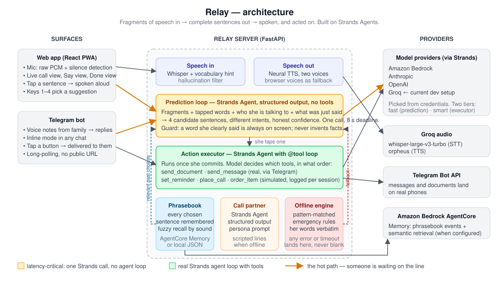

# Relay

**A voice for people with aphasia.**

Aphasia takes away the path from a thought to the words for it. The person is
still entirely there — comprehension, intelligence, opinions — but the sentence
gets stuck on the way out. Phone calls are the worst case: no gestures, no face,
a stranger who will hang up.

Relay listens to whatever *does* come out — a syllable, a tapped word, a broken
fragment — and, while the person is still mid-sentence, shows three or four
complete things they might be trying to say. They tap one. It is spoken in their
voice. If it asked for something to happen — a reminder, a document sent, a
booking — it happens.

Think of it as the AI version of a telecom relay service for the deaf, but for
word-finding instead of hearing.

## Architecture



## How it works

Built on **[Strands Agents](https://strandsagents.com)**, AWS's open-source
agent SDK, with two deliberately different model tiers:

| Workload | Why it is shaped this way | Strands usage |
|---|---|---|
| **Prediction loop** — fragments → candidate sentences | Fires every time speech pauses, with someone waiting on the line. Latency *is* the feature. | `Agent(tools=[])` + `structured_output_model` — one constrained call, no agent loop |
| **Action executor** — "send my scan to Dr. Chen and remind me Tuesday" | Runs once after the user commits. Genuinely multi-step. | Real agent loop with `@tool` functions |
| **Call partner** — the simulated receptionist | Must ask one question at a time and be realistically brisk | Fast model with a persona prompt |

**Personalisation** — every sentence the user picks is remembered and fed back
into the next prediction: the choices most *relevant* to what she is saying
right now, then the most recent. Backed by **Amazon Bedrock AgentCore Memory**
(raw events for exact phrasing, a semantic strategy for retrieval by meaning);
a local JSON store otherwise, with the same interface.

**Never goes silent** — if the live model is unreachable (conference wifi), the
prediction loop falls back to a pattern-matched offline engine rather than an
empty screen. The status pill in the header shows which engine answered.

### Model providers

Relay picks a provider from whatever credentials it finds, in order:
**Bedrock → Anthropic → OpenAI → Groq → offline**. Switching is a config
change; there is no provider-specific code path. Groq (`openai/gpt-oss-120b`)
is the current dev setup: ~1.7 s warm on the prediction loop, one round trip.

```
server/relay/
  predictor.py   the prediction loop
  executor.py    the action agent + @tool definitions
  caller.py      simulated call partner
  memory.py      AgentCore Memory / local fallback
  prompts.py     the prompts — the most load-bearing file here
  scripted.py    offline engine
  providers.py   Bedrock / Anthropic / OpenAI model construction
web/src/
  components/CallView.tsx     the live-call surface
  components/ComposeView.tsx  voice notes, messages, in-person
  hooks/usePredictor.ts       debounced, cancellable prediction
```

## Running it

Two processes: a Python API on `:8787` and a Vite dev server on `:5173`.

### Server (Python 3.10+)

```bash
cd server
python -m venv .venv
# Windows:  .venv\Scripts\activate       macOS/Linux:  source .venv/bin/activate
pip install -r requirements.txt
cp .env.example .env                    # add a key, or leave blank for offline mode
uvicorn relay.app:app --port 8787 --reload
```

### Web (Node 20+)

```bash
cd web
npm install
npm run dev
```

Open <http://localhost:5173> in **Chrome or Edge** (speech input uses the Web
Speech API; other browsers get typing and the word board).

### Enabling Bedrock

1. Bedrock console → **Model access** → enable Claude Haiku 4.5 and Claude
   Sonnet 4.6 in your region.
2. Either generate a **Bedrock API key** (console → API keys) and set
   `AWS_BEDROCK_API_KEY`, or use normal AWS credentials / a profile.
3. Confirm the exact model ids in the console — they carry an account/region
   prefix — and set `BEDROCK_FAST_MODEL` / `BEDROCK_SMART_MODEL` if they differ
   from the defaults in `.env.example`.
4. Set `LLM_PROVIDER=bedrock` (or leave `auto`). No reinstall needed.

### Enabling AgentCore Memory

With AWS credentials in `.env` (or a profile), create the resource once:

```bash
python scripts/create_memory.py
```

Paste the printed id into `AGENTCORE_MEMORY_ID`. The local JSON store is used
until then, and again if AgentCore is unreachable — memory never blocks speech.

### Relay in Telegram (free)

1. Message **@BotFather** → `/newbot` → paste the token into `TELEGRAM_BOT_TOKEN`.
2. In BotFather: `/setinline` (any placeholder), then `/setinlinefeedback` → Enabled.
3. Restart the server. It long-polls; no public URL needed.

Then, on phones:

- Maya's phone: open the bot, send `/me`. Send a voice note — replies appear
  as buttons.
- A family member's phone: open the bot, send `/link Sam`. Whatever they send
  (text or voice) arrives on Maya's phone with reply candidates; she taps one
  and it is delivered to them.
- In **any** chat, type `@YourBot om tues` — the candidates pop up and the one
  she taps is sent as her own message.
- "Send my scan to Dr. Chen" runs the Strands executor, whose `send_document`
  tool posts a PDF into the linked Dr. Chen chat.
- "Tell Sam I'll be late" → Sam's phone. "Call Dr. Chen for an appointment" →
  Dr. Chen is asked to ring her. "Remind me at 4" → her phone buzzes at 4.
- "Help, there's a fire" → every adult contact gets an alert with her words
  and, if she shared it, a map pin of where she is.

## What is real and what is simulated

Judges should know exactly what they are looking at.

| Piece | Status |
|---|---|
| Prediction loop, executor agent, call partner | Real Strands agents, live model calls |
| Speech in (Whisper) and out (neural TTS) | Real, via Groq; browser fallbacks |
| `send_message`, `send_document`, `share_location` tools | **Real** — deliver to linked Telegram chats (message, PDF, map pin) |
| `set_reminder` tool | **Real** — the agent computes the time; the reminder fires on schedule to the user's Telegram chat and the Done tab, and survives a restart |
| `alert_emergency` tool | **Real alerts, simulated call** — every adult contact on Telegram gets an alert with her words and a map link; the call to fire brigade / ambulance / police is logged, not dialled |
| `place_call` tool | **Half real** — no telephony; the contact is told on Telegram that she is calling and asked to ring her, and she is pointed to the assisted-call view |
| `order_item` tool | **Simulated** — a receipt is logged to the Done tab; nothing external happens |
| Emergency and request detection | **Code, not model** — "fire", "help", "chest pain", "tell Sam…", "call Dr. Chen", "remind me…" always reach the agent, whatever the predictor attached |
| Location | Only with her consent, via Telegram's own share-location prompt (`/me` or `/where`); used solely in alerts and `share_location` |
| Knowing her better | Only what she gives it: a contact card shared from her phone book adds a person; `/note` adds a fact about her life. Both feed the predictor and Whisper's vocabulary at once. Relay does not read other chats, call logs, or notes apps — a native app would be needed, and that is future work |
| Phone calls | **Simulated partner** (receptionist, pharmacy, son). No telephony. The hard part — replying in time — is fully exercised |
| Personalisation memory | Real; local JSON store today, AgentCore Memory backend coded and switchable by config |
| Demo persona "Maya Ellis" and her contacts | Fictional |

Built during the hackathon submission period with AI coding assistance
(Claude Code). No pre-existing code was incorporated.

## Demo script (≈3 min)

1. **Call → Book an appointment.** The receptionist answers. Say "doc… Tues…"
   or tap *Dr. Chen* + *Tuesday*. Four replies appear. Tap one; Relay speaks it.
2. The receptionist asks *when*. Replies appear **before you say anything** —
   that is the moment to point at.
3. Finish the booking. Switch to **Done** — the reminder is there.
4. **Say → Voice note.** Show the same engine with no one on the line.
5. Point at the status pill: the model, the latency, and that it survives
   losing the network.

Press **1–4** to pick a suggestion from the keyboard while narrating.
